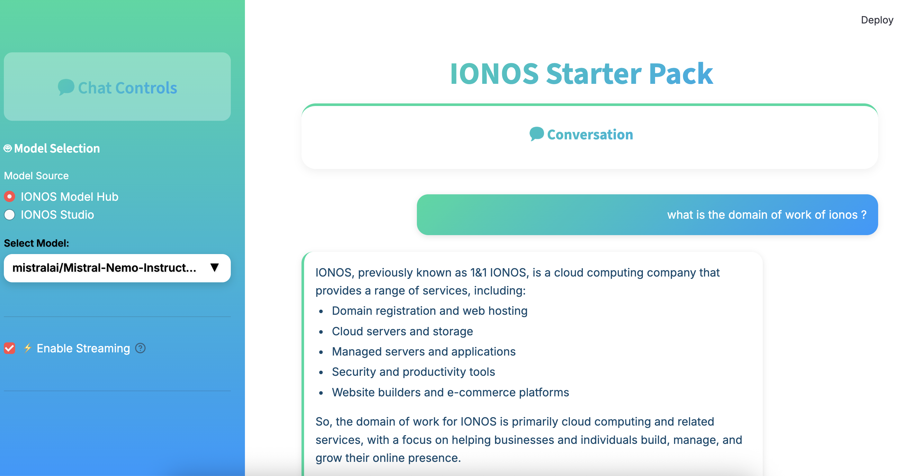

## Project Overview

This repository contains a **full-stack RAG chatbot** powered by LangChain and IONOS, with separate **frontend** and **backend** folders:

- **frontend**: A Next.js (React) application that allows users to input a page URL, select a model, and chat with an AI assistant based on website content.
- **backend**: A FastAPI service that:

  1. Scrapes and indexes webpage text using TF-IDF for RAG.
  2. Routes chat requests to IONOS AI models, managing conversation history.
  3. Exposes endpoints for initializing RAG index, fetching chat history, and sending user messages.

---

## Table of Contents

- [Prerequisites](#prerequisites)
- [Environment Variables](#environment-variables)
- [Backend Setup](#backend-setup)
- [Frontend Setup](#frontend-setup)
- [Usage](#usage)
- [Project Structure](#project-structure)
- [License](#license)
 - [CI/CD Deployment](#cicd-tag-based-build--kubernetes-deployment)
 - [License](#license)

---

## Prerequisites

Before you begin, ensure you have:

- **Node.js** (v18 or above) and **npm** or **yarn**
- **Python** (v3.10 or above)
- **pip** or **poetry** for Python dependencies
- An **IONOS API Key** for language model access

---

## Environment Variables

Create a `.env` file in both the **frontend** and **backend** folders using the following template:
(you can instead create a single unique .env file at project root if you prefer)

```dotenv
# Frontend (Next.js)
NEXT_PUBLIC_APP_BASE_URL=http://localhost:8000  # URL of the backend API

# Shared / Backend (.env)
IONOS_API_KEY=your_ionos_api_key_here           # IONOS AI Model Hub key
RAG_K=3                                         # top-k RAG chunks to retrieve (default: 3)
CHUNK_SIZE=500                                  # chars per chunk (default: 500)
MAX_CHUNK_COUNT=256                             # maximum number of chunks (default: 256)
```

- **NEXT_PUBLIC_APP_BASE_URL**: URL where your backend is running, used by the frontend.

- **IONOS_API_KEY**: Your secret key for accessing IONOS AI Model Hub (required by the backend).
- **RAG_K**: Number of top chunks to retrieve for context.
- **CHUNK_SIZE**: Maximum characters per chunk when splitting scraped text.
- **MAX_CHUNK_COUNT**: Cap on total chunks to index.

---

## Backend Setup

1. **Navigate** to the `backend` folder:

   ```bash
   cd backend
   ```

2. **Install** dependencies:

   ```bash
   pip install -r requirements.txt
   ```

3. **Run** the FastAPI server locally:

   ```bash
   python main.py
   ```

   The backend will be available at `http://localhost:8000`.

---

## Frontend Setup

1. **Navigate** to the `frontend` folder:

   ```bash
   cd frontend
   ```

2. **Install** dependencies:

   ```bash
   npm install
   # or
   yarn install
   ```

3. **Start** the development server:

   ```bash
   npm run dev
   # or
   yarn dev
   ```

   The frontend will be available at `http://localhost:3000`.

---

## Usage

1. **Open** your browser at `http://localhost:3000`.
2. **Enter** a page URL to scrape and wait for RAG initialization.
3. **Select** an AI model from the dropdown.
4. **Start** chatting—messages will be sent to the backend, enriched with top-k context, and answered by your chosen model.

---

## Project Structure

```
├── frontend             # Next.js React app
│   ├── .env             # Frontend environment config
│   ├── app/
│   ├── components/
│   ├── public/
│   ├── lib/
│   └── package.json
└── backend              # FastAPI service
    ├── .env             # Backend environment config
    ├── main.py          # FastAPI entrypoint
    ├── requirements.txt
    └── other modules…
```

---

## License

This project is released under the [MIT License](LICENSE). Feel free to use and modify it in your own applications.

---

## CI/CD: Tag-Based Build & Kubernetes Deployment

This repository includes an automated deployment workflow located at `.github/workflows/deploy.yml`. It builds versioned container images for the backend and Streamlit frontend, then deploys them to an IONOS-managed Kubernetes cluster when a version tag is pushed.

### Trigger

- Event: `push`
- Condition: Git tag name matches the regex `[0-9]+.[0-9]+.[0-9]+` (examples: `1.0.0`, `2.3.7`). Only tags in this strict numeric format start the workflow.

### High-Level Steps

1. Checkout source code.
2. Log in to the container registry using `DOCKER_USERNAME` / `DOCKER_PASSWORD` and the repository variable `IMAGE_REGISTRY`.
3. Build & push two images (version + `latest` tag each):
   - Backend (`./backend`, `./backend/Dockerfile`)
   - Frontend Streamlit app (`./frontends/streamlit-starter`, `./frontends/streamlit-starter/Dockerfile`)
4. Install `kubectl` via `azure/setup-kubectl`.
5. Configure kube context using the `KUBE_CONFIG` secret.
6. Recreate Kubernetes secret `secrets` with keys `IONOS_API_KEY` and `TAVILY_API_KEY`.
7. Template `kubernetes_config.tpl` into `kubernetes_config.yaml` using `envsubst` (environment variable substitution).
8. Validate manifest with a client-side dry run.
9. Apply manifest to the cluster.
10. Wait for rollout completion of deployments `backend` and `streamlit`.

### Image Tagging Convention

For each successful tagged build:

| Component | Immutable Tag | Convenience Tag |
|-----------|---------------|-----------------|
| Backend   | `<IMAGE_REGISTRY>/backend:<tag>`   | `<IMAGE_REGISTRY>/backend:latest`   |
| Frontend  | `<IMAGE_REGISTRY>/frontend:<tag>`  | `<IMAGE_REGISTRY>/frontend:latest`  |

Use the immutable (version) tag in production manifests; `latest` is only a moving pointer.

### Variables & Secrets Consumed

| Type | Name | Purpose |
|------|------|---------|
| Repository Variable | `IMAGE_REGISTRY` | Base registry path used for tagging & login |
| Git Tag (runtime) | `github.ref_name` → `VERSION` | Version string injected into image names |
| Secret | `DOCKER_USERNAME` / `DOCKER_PASSWORD` | Registry authentication |
| Secret | `KUBE_CONFIG` | kubeconfig content for cluster access |
| Secret | `IONOS_API_KEY` | Access to IONOS AI Model Hub |
| Secret | `TAVILY_API_KEY` | Use the Tavily web search tool in the agent |

### Kubernetes Secret Handling

The workflow deletes (if present) and recreates a generic secret named `secrets` containing `IONOS_API_KEY` and `TAVILY_API_KEY` each run, ensuring updated credential values are applied.

### Deployment Validation

After applying manifests, the workflow blocks until both deployments report a successful rollout:

```
kubectl rollout status deployment/backend
kubectl rollout status deployment/streamlit
```

### Creating a Deployment Tag

Push a semantic (numeric) tag to trigger the pipeline:

```bash
git pull
git tag 1.2.0
git push origin 1.2.0
```

### Correcting a Mistaken Tag (Before Rerun)

```bash
git tag -d 1.2.0
git push origin :refs/tags/1.2.0
git tag 1.2.1
git push origin 1.2.1
```

### Summary

Tagging a commit with a properly formatted version (`X.Y.Z`) triggers an automated build of backend and frontend images, publication to the configured registry (both immutable and `latest` tags), templating of the Kubernetes manifest, and a controlled rollout with status verification. No additional testing, linting, or release note generation steps are part of this workflow at present.
