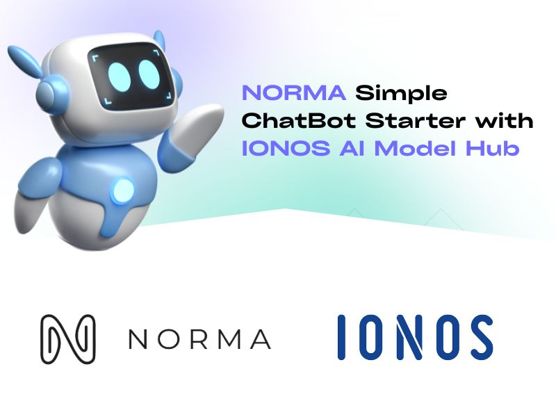

## Project Overview

This repository contains a **full-stack RAG chatbot** powered by LangChain and IONOS, with separate **frontend** and **backend** folders:

* **frontend**: A Next.js (React) application that allows users to input a page URL, select a model, and chat with an AI assistant based on website content.
* **backend**: A FastAPI service that:

  1. Scrapes and indexes webpage text using TF-IDF for RAG.
  2. Routes chat requests to IONOS AI models, managing conversation history.
  3. Exposes endpoints for initializing RAG index, fetching chat history, and sending user messages.

This setup can be deployed locally or on AWS Lambda (via Mangum) and uses environment variables for configuration.

---

## Table of Contents

* [Prerequisites](#prerequisites)
* [Environment Variables](#environment-variables)
* [Backend Setup](#backend-setup)
* [Frontend Setup](#frontend-setup)
* [Usage](#usage)
* [Project Structure](#project-structure)
* [License](#license)

---

## Prerequisites

Before you begin, ensure you have:

* **Node.js** (v18 or above) and **npm** or **yarn**
* **Python** (v3.10 or above)
* **pip** or **poetry** for Python dependencies
* An **IONOS API Key** for language model access

---

## Environment Variables

Create a `.env` file in both the **frontend** and **backend** folders (or at project root if you prefer) using the following template:

```dotenv
# Frontend (Next.js)
REACT_APP_BASE_URL=http://localhost:8000  # URL of the backend API

# Shared / Backend (.env)
IONOS_API_KEY=your_ionos_api_key_here      # IONOS AI Model Hub key
RAG_K=3                                  # top-k RAG chunks to retrieve (default: 3)
CHUNK_SIZE=500                            # chars per chunk (default: 500)
MAX_CHUNK_COUNT=256                      # maximum number of chunks (default: 256)
```

* **REACT\_APP\_BASE\_URL**: URL where your backend is running, used by the frontend.
* **IONOS\_API\_KEY**: Your secret key for accessing IONOS AI Model Hub (required by the backend).
* **RAG\_K**: Number of top chunks to retrieve for context.
* **CHUNK\_SIZE**: Maximum characters per chunk when splitting scraped text.
* **MAX\_CHUNK\_COUNT**: Cap on total chunks to index.

---

## Backend Setup

1. **Navigate** to the `backend` folder:

   ```bash
   cd backend
   ```
2. **Install** dependencies:

   ```bash
   pip install -r requirements.txt
   ```
3. **Run** the FastAPI server locally:

   ```bash
   uvicorn main:app --reload
   ```

   The backend will be available at `http://localhost:8000`.

---

## Frontend Setup

1. **Navigate** to the `frontend` folder:

   ```bash
   cd frontend
   ```
2. **Install** dependencies:

   ```bash
   npm install
   # or
   yarn install
   ```
3. **Start** the development server:

   ```bash
   npm run dev
   # or
   yarn dev
   ```

   The frontend will be available at `http://localhost:3000`.

---

## Usage

1. **Open** your browser at `http://localhost:3000`.
2. **Enter** a page URL to scrape and wait for RAG initialization.
3. **Select** an AI model from the dropdown.
4. **Start** chatting—messages will be sent to the backend, enriched with top-k context, and answered by your chosen model.

---

## Project Structure

```
├── frontend             # Next.js React app
│   ├── .env             # Frontend environment config
│   ├── app/
│   ├── components/
│   ├── public/
│   ├── lib/
│   └── package.json
└── backend              # FastAPI service
    ├── .env             # Backend environment config
    ├── main.py          # FastAPI entrypoint
    ├── requirements.txt
    └── other modules…
```

---

## License

This project is released under the [MIT License](LICENSE). Feel free to use and modify it in your own applications.
