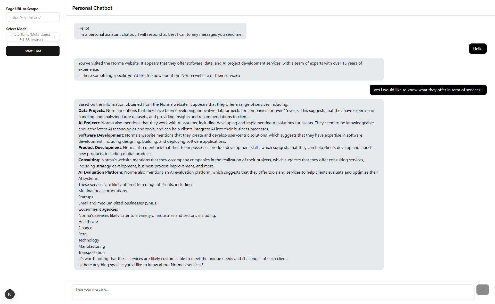

## Project Overview

This repository contains a **full-stack AI chatbot powered by IONOS AI**, featuring a ReAct agent with real-time web search capabilities. The project includes:

- **Backend**: FastAPI service with LangGraph ReAct agent that uses Tavily for web search and integrates with both IONOS AI Model Hub (inference models) and IONOS AI Model Studio (fine-tuned models).
- **Frontend**: Two options:
  - **Streamlit** (recommended): Modern, interactive chat interface with real-time streaming support
  - **Next.js** (alternative): React-based web application

---

## Key Features

- 🤖 **Intelligent ReAct Agent**: LangGraph-powered agent with tool-calling capabilities
- 🔍 **Real-time Web Search**: Integrated Tavily API for up-to-date information retrieval
- 🎯 **Dual Model Support**:
  - IONOS Model Hub (inference models with web search)
  - IONOS Studio (fine-tuned models for specialized tasks)
- ⚡ **Streaming Responses**: Real-time token-by-token output for Hub models
- 💬 **Conversation History**: Context-aware multi-turn conversations
- 🚀 **Production Ready**: Kubernetes deployment with CI/CD pipeline

---

## Table of Contents

- [Prerequisites](#prerequisites)
- [Environment Variables](#environment-variables)
- [Backend Setup](#backend-setup)
- [Frontend Setup](#frontend-setup)
  - [Streamlit (Recommended)](#streamlit-recommended)
  - [Next.js (Alternative)](#nextjs-alternative)
- [Usage](#usage)
- [Project Structure](#project-structure)
- [Adding Fine-tuned Models](#adding-fine-tuned-models)
- [CI/CD Deployment](#cicd-tag-based-build--kubernetes-deployment)
- [Documentation](#documentation)
- [License](#license)

---

## Prerequisites

Before you begin, ensure you have:

- **Python** (v3.10 or above)
- **pip** for Python dependencies
- **Node.js** (v18 or above) and **npm** (only if using Next.js frontend)
- An **IONOS API Key** for AI Model Hub access
- A **Tavily API Key** for web search functionality
- **(Optional)** IONOS Studio API key for fine-tuned models

---

## Environment Variables

### Backend `.env`

Create a `.env` file in the `backend` folder:

```dotenv
# Required
IONOS_API_KEY=your_ionos_api_key_here
TAVILY_API_KEY=your_tavily_api_key_here

# Optional: IONOS Studio fine-tuned models
STUDIO_API_KEY=your_studio_api_key_here
STUDIO_ORG_ID=your_studio_org_id_here
STUDIO_BASE=https://studio.ionos.de/api/v1

# Fine-tuned model UUIDs (add as many as needed)
STUDIO_MODEL_QWEN_GDPR=model_uuid_here
STUDIO_MODEL_GRANITE_GDPR=model_uuid_here
STUDIO_QWEN3_SHAREGPT=model_uuid_here
```

### Frontend `.env`

**Streamlit** (`frontends/streamlit-starter/.env`):
```dotenv
BACKEND_URL=http://localhost:8000
IONOS_API_KEY=your_ionos_api_key_here
```

**Next.js** (`frontends/next-js-starter/.env`):
```dotenv
NEXT_PUBLIC_APP_BASE_URL=http://localhost:8000
```

---

## Backend Setup

1. **Navigate** to the `backend` folder:

   ```bash
   cd backend
   ```

2. **Create and activate** a virtual environment:

   **macOS/Linux:**
   ```bash
   python3 -m venv .venv
   source .venv/bin/activate
   ```

   **Windows:**
   ```powershell
   python -m venv .venv
   .\.venv\Scripts\Activate.ps1
   ```

3. **Install** dependencies:

   ```bash
   pip install -r requirements.txt
   ```

4. **Create** `.env` file with required variables (see [Environment Variables](#environment-variables))

5. **Run** the FastAPI server:

   ```bash
   uvicorn main:app --host 127.0.0.1 --port 8000 --reload
   ```

   The backend will be available at `http://localhost:8000`.

---

## Frontend Setup

### Streamlit (Recommended)

1. **Navigate** to the Streamlit folder:

   ```bash
   cd frontends/streamlit-starter
   ```

2. **Create and activate** a virtual environment:

   **macOS/Linux:**
   ```bash
   python3 -m venv .venv
   source .venv/bin/activate
   ```

   **Windows:**
   ```powershell
   python -m venv .venv
   .\.venv\Scripts\Activate.ps1
   ```

3. **Install** dependencies:

   ```bash
   pip install -r requirements.txt
   ```

4. **Create** `.env` file with `BACKEND_URL=http://localhost:8000` and `IONOS_API_KEY`

5. **Run** the Streamlit app:

   ```bash
   streamlit run app.py
   ```

   The app will open automatically at `http://localhost:8501`.

### Next.js (Alternative)

1. **Navigate** to the Next.js folder:

   ```bash
   cd frontends/next-js-starter
   ```

2. **Install** dependencies:

   ```bash
   npm install
   ```

3. **Create** `.env` file with `NEXT_PUBLIC_APP_BASE_URL=http://localhost:8000`

4. **Start** the development server:

   ```bash
   npm run dev
   ```

   The app will be available at `http://localhost:3000`.

---

## Usage

1. **Start the backend** (see [Backend Setup](#backend-setup))
2. **Start your preferred frontend** (see [Frontend Setup](#frontend-setup))
3. **Select a model type**:
   - **Inference**: IONOS Hub models with web search capabilities
   - **Fine-tuned**: Your custom Studio models for specialized tasks
4. **Choose a model** from the dropdown
5. **Start chatting**—the agent will search the web when needed and provide informed responses

---

## Project Structure

```
IONOS-simple-chatbot/
├── .env                        # Root environment variables (optional)
├── .env.template              # Environment template
├── README.md
├── LICENSE
├── CODE_OF_CONDUCT.md
├── docker-compose.yml         # Docker Compose configuration
├── kubernetes_config.tpl      # K8s deployment template
├── pyproject.toml            # Root Python project metadata
├── uv.lock                   # UV lockfile
│
├── backend/                   # FastAPI service
│   ├── main.py               # API endpoints and routing
│   ├── chatbot_agent.py      # LangGraph ReAct agent setup
│   ├── studio_client.py      # IONOS Studio API client
│   ├── requirements.txt      # Python dependencies
│   ├── Dockerfile            # Container image definition
│   ├── Makefile              # Build automation
│   └── .env                  # Backend environment config
│
├── frontends/
│   ├── streamlit-starter/    # Streamlit UI (recommended)
│   │   ├── app.py           # Main application
│   │   ├── requirements.txt # Python dependencies
│   │   └── Dockerfile       # Container image
│   │
│   └── next-js-starter/      # Next.js UI (alternative)
│       ├── app/             # Next.js app directory
│       │   ├── layout.tsx
│       │   ├── page.tsx
│       │   └── globals.css
│       ├── components/      # React components
│       │   ├── ChatLog.tsx
│       │   ├── Message.tsx
│       │   ├── TextInput.tsx
│       │   └── ui/         # Shadcn UI components
│       ├── lib/            # Utilities
│       ├── public/         # Static assets
│       ├── package.json
│       └── tsconfig.json
│
├── docs/                     # Documentation site (Nextra)
│   ├── pages/
│   │   ├── docs/
│   │   │   ├── getting-started/
│   │   │   ├── backend/
│   │   │   ├── frontend/
│   │   │   └── deployment/
│   │   └── index.tsx
│   ├── public/assets/       # Documentation assets
│   ├── styles/
│   ├── package.json
│   └── next.config.mjs
│
└── assets/
    └── images/              # Repository images
        ├── cover.jpg
        └── screenshot.png
```

---

## Adding Fine-tuned Models

To add a new IONOS Studio fine-tuned model:

1. **Add the model UUID** to `backend/.env`:
   ```dotenv
   STUDIO_MODEL_YOUR_NAME=your-model-uuid-here
   ```

2. **Register the model** in `backend/main.py`:
   ```python
   @app.get("/studio/models")
   async def get_studio_models():
       models = {
           "qwen-gdpr": os.getenv("STUDIO_MODEL_QWEN_GDPR"),
           "your-model-name": os.getenv("STUDIO_MODEL_YOUR_NAME"),  # Add this
       }
       return {k: v for k, v in models.items() if v}
   ```

3. **Restart the backend**—the model will appear in the frontend dropdown automatically

---

## CI/CD: Tag-Based Build & Kubernetes Deployment

This repository includes automated CI/CD via GitHub Actions (`.github/workflows/deploy.yml`).

### Trigger

Push a version tag matching `X.Y.Z` format (e.g., `1.0.0`, `2.3.7`):

```bash
git tag 1.0.0
git push origin 1.0.0
```

### Workflow Steps

1. **Build & Push** Docker images for backend and Streamlit frontend
2. **Tag** images with both version number and `latest`
3. **Deploy** to IONOS Kubernetes cluster
4. **Update** secrets with `IONOS_API_KEY` and `TAVILY_API_KEY`
5. **Validate** deployment with rollout status checks

### Required Secrets

Configure these in your GitHub repository settings:

- `DOCKER_USERNAME` / `DOCKER_PASSWORD`: Container registry credentials
- `KUBE_CONFIG`: Kubernetes cluster configuration
- `IONOS_API_KEY`: IONOS AI Model Hub API key
- `TAVILY_API_KEY`: Tavily web search API key
- `STUDIO_API_KEY`: (Optional) IONOS Studio API key
- `STUDIO_ORG_ID`: (Optional) Studio organization ID

### Image Naming

| Component | Version Tag | Latest Tag |
|-----------|-------------|------------|
| Backend   | `<registry>/backend:1.0.0` | `<registry>/backend:latest` |
| Frontend  | `<registry>/frontend:1.0.0` | `<registry>/frontend:latest` |

---

## Documentation

Comprehensive documentation is available at the `/docs` directory, powered by Nextra. Topics include:

- 📖 **Getting Started**: Prerequisites, environment setup, installation
- 🔧 **Backend**: API reference, agent tools, troubleshooting
- 🎨 **Frontend**: Streamlit and Next.js setup guides
- 🚀 **Deployment**: Docker, Kubernetes, CI/CD pipelines
- 🏗️ **Architecture**: Project structure, model routing, agent design

To run the docs locally:

```bash
cd docs
npm install
npm run dev
```

Visit `http://localhost:3000` to browse the documentation.

---

## License

This project is released under the [MIT License](LICENSE). Feel free to use and modify it in your own applications.

---

## Contributing

Contributions are welcome! Please feel free to submit a Pull Request.

---

## Support

For issues, questions, or feature requests, please open an issue on GitHub.

---

**Built with ❤️ using IONOS AI, LangGraph, FastAPI, and Streamlit**
