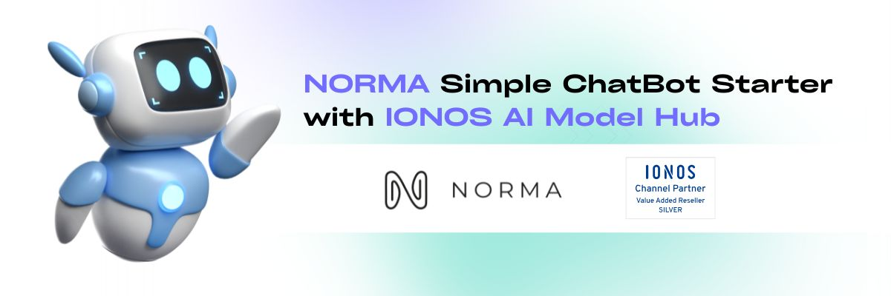

## Description

A chatbot powered by OpenAI, presented in a iMessage-like experience, with a FastAPI backend.

### Why this tech stack?

This project focuses on leveraging React and FastAPI to create a streamlined iMessage-like experience chatting with an AI assistant. This was also an opportunity to leverage a cloud-based deployment using AWS Lambda.

### Why React?

I've worked with React on other projects, but I wanted to build another mobile-first, simplistic, clean user interface with it which leveraged Bootstrap.

## Installation

Here are the things you'll need if you want to run this project locally:

1. [NodeJS](https://nodejs.org/en/download)
2. [Python](https://www.python.org/downloads/)

Once the above is installed:

1. Clone this repository
2. Open a terminal and navigate to the project's root directory
3. Install the required packages via NPM

    ```shell
    npm install
    ```

4. Install the required packages for Python

    ```shell
    cd backend/
    python -m pip install -r requirements.txt
    ```

## Usage

Rename **_.env.template_** to **_.env_**

Use of the OpenAI API requires an API token,

To run the project locally, you'll need to run both the client and the server:

```shell
cd frontend/
npm run start
```

```shell
cd backend/
python main.py
```
